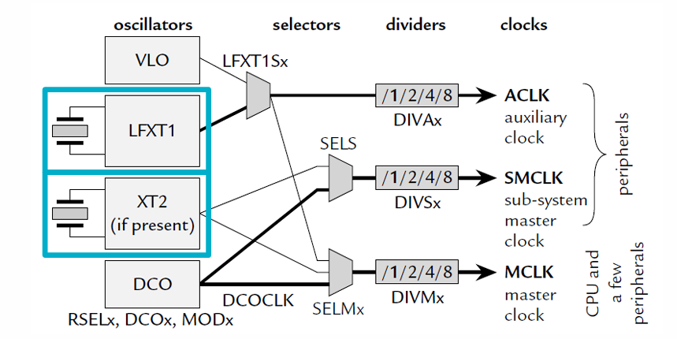
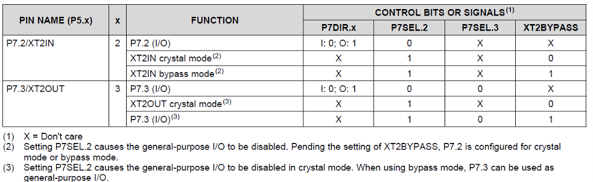
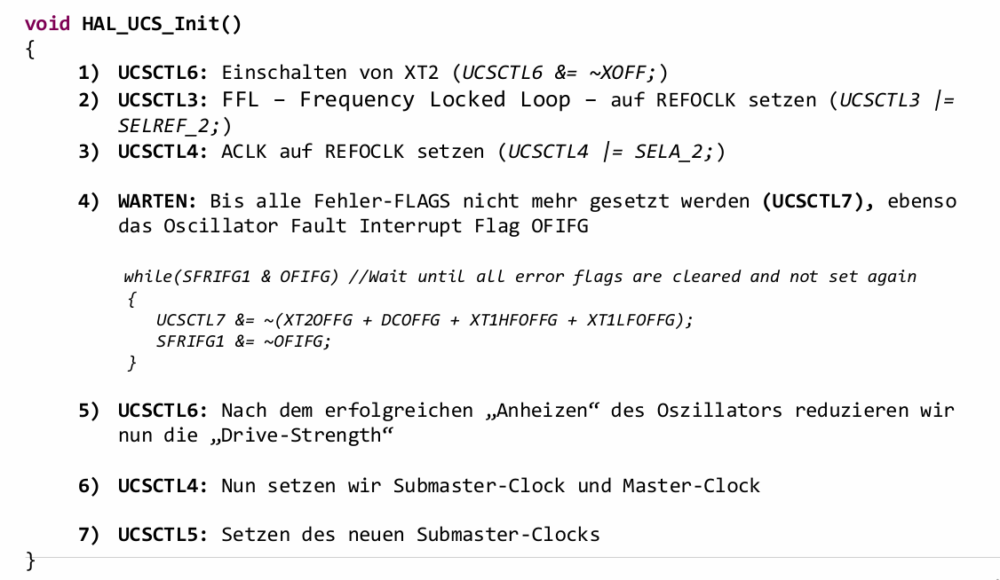
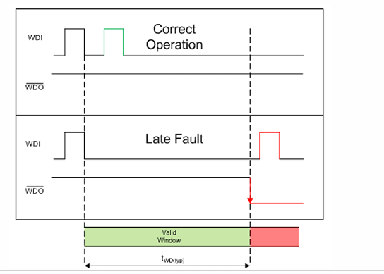
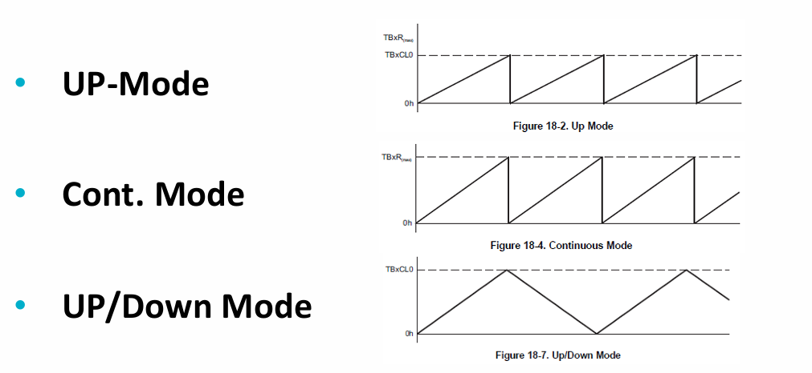
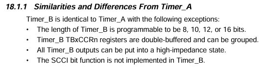
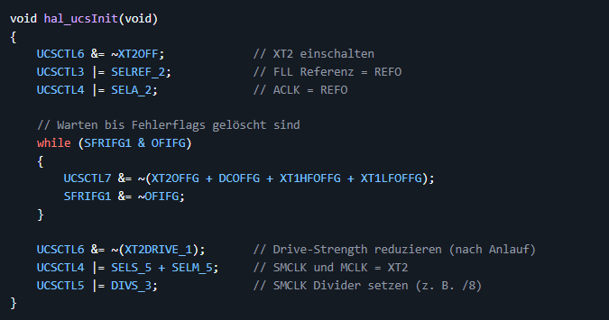

# Chapter 3 - TimerB0

There are 3 different clockrates: 
- ACLK (Auxiliary Clock): für stromsparende Peripherien (z. B. RTC, Timer)
- SMCLK (Sub-Main Clock): für schnelle Peripherien (Timer, UART, etc.)
- MCLK (Main Clock): Systemtakt für die CPU

The masterclock works with 20MHz, the submster clock with 2.5MHz (MCLK divided 8) and the auxilary clock with 32 768Hz. 

PMM stands for Power Managment Module. 

If a LED should blink every 2Hz, it means that it is on and off for 0.25s. In total is that 0.5s (time = 1/f).

Before using the clock for the timerB0, the submaster clock has to be configurated. 

The difference between LFXT1 and XT2 is their frequency. LFXT1 is used when working with low f and XT2 with high f. 

What it the big difference in stable and precise rates?
> A stable clockrate does not change when the temperature is rising.
> A precise clockrate deviates only by 10^-5 

What is seen in the picture?
> 
> There are 2 different modes: Crystal mode (using the build in clock) or bybass mode (external clock)
> 

How should the clock be configured?
> 

What does the watchdog timer do?
> 
> If the system doesn't responce and there is no answer, the watchdog things it is in a loop and can't get out. So it resets the msp430.

What are the task that a timer should do?
> Compare: it compares the TAR value with the configured TACCRn
> Capture: it captures the time when the TACCRn is changed
> Sample: Input is compared with an event. Great for serial communication.

What are the 3 different modes a timer can have?
> 

What is the big difference between TimerA and TimerB?
> 

What is UCS?   
> unifield clock system 
> it controlls the clockrates. In this case it controlls the MCLK, SMCLK and ACLK
> 

In which register is the to be compared value stored?
> in the TAxCCR0 or TBxCCR0 

## Questions from Git

Why is a timer better than using for example a for-loop?
> The CPU doesn't need to waste time counting up and it is much more effizient. 

How many timers does the msp430 have and what are the differences between timerA and timerB?    
> The difference was already answered.
> The msp430 has 3 different timers: A, B and D.
> TimerA, B and C have both 7 capture/compare register. (informationsource unknown)
> The timerD has a much higher resolution than the others. 

What are the difference between the SMCLK- and TBxEX0-divider?
> The SMCLK-divider is diving the MCLK rate and the TBxEX0-divider is dividing SMCLK rate even further. 

Is it possible to use 2 pwm-timers parallel?
> Yes, because timerA and timerB are not connected and can work independently. 
