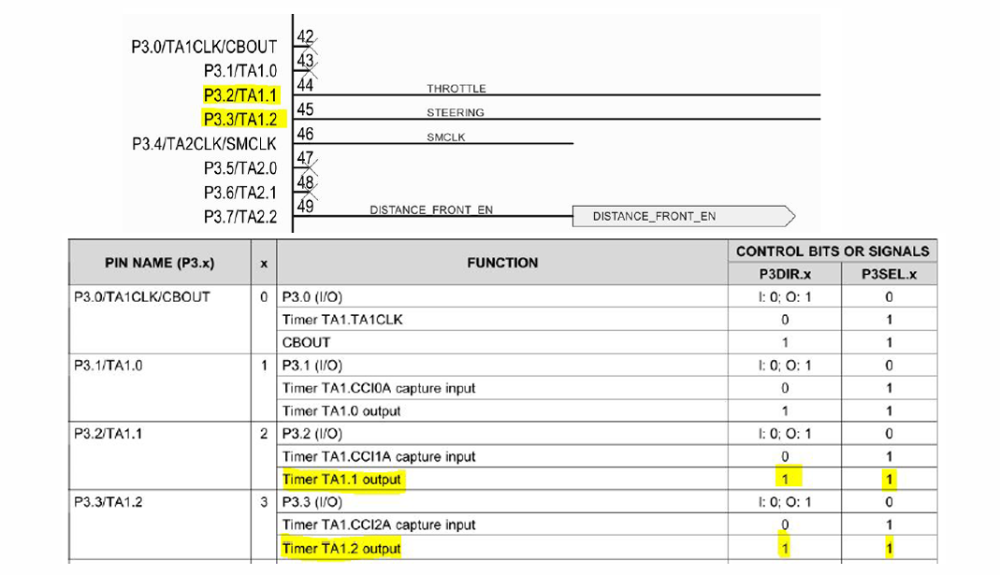
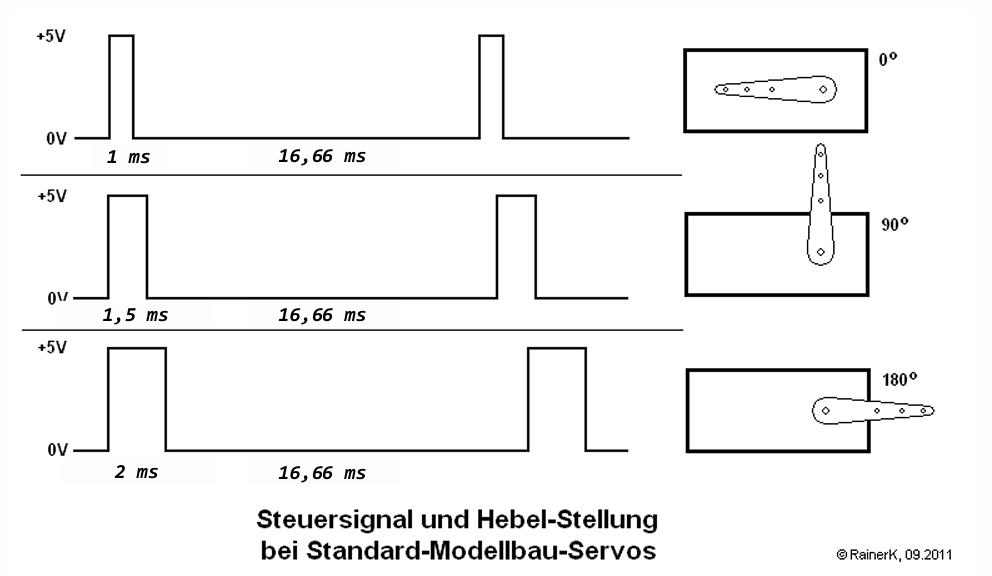

## Lab 4 - PWM

What is pwm?
> pulse width modulation 
> It the ratio of the on-time to the total period of a signal. 
> With it the power can be controlled. 
> 

What are the advantages?
> hoher Wirnkungsgrad
> geringere Verlustleistung
> Oberwellen werden durch mech. Trägheit geglättet

Which pins needed to be controlled?
> 

Here is a picture of a Servo:
> 

